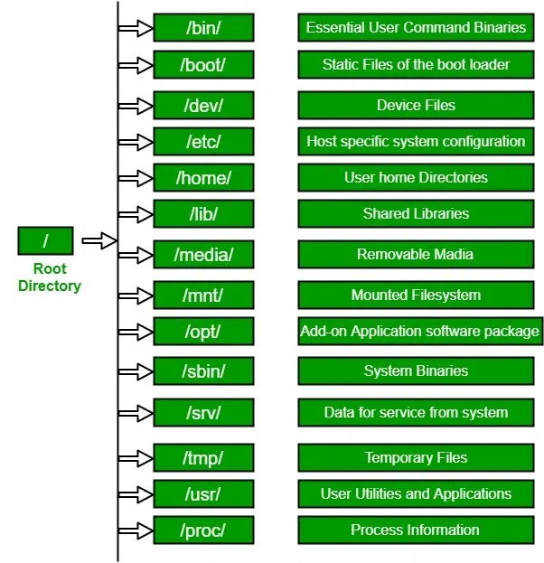

# Linux File Hierarchy Structure

The Linux File Hierarchy Structure or the File System Hierarchy Standard (FHS) defines the directory structure and directory contents.

- In the FHS, all files and directories appear under the root directory `/`, even if they are stored on different physical or virtual devices.
  

 


---
### 1. `/` (Root):
Primary hierarchy root and root directory of the entire file system hierarchy.
- Every single file and directory start from the root directory.
- The only root user has the right to write under this directory.
- `/root` is the root user's home directory, which is not the same as `/`

```
$ ls /
bin   dev  home  lib32  libx32      media  opt   root  sbin  sys  usr
boot  etc  lib   lib64  lost+found  mnt    proc  run   srv   tmp  var
```


---
### 2. `/bin`:
Essential command binaries taht need to be available in single-user mode; for all users, e.g, `cat`, `ls`, `cp`
- Contains binary executables

---
### 3. `/boot`
Boot loader files, e.g., kernels, initrd
- Kernel initrd, vmlinux, grub files are located under `/boot`
  

---
### 4. `/dev`:
Essential device files, e.g., `/dev/null`
- These include terminal devices, usb, or any device attached to the system.
- Example: `/dev/tt1`, `/dev/usbmon0`

---
### 5. `/etc`:
Host-specific system-wide configuration files.
- Container configuration files required by all programs.
- This also contains startup and shutdown shell scripts used to start/stop individual programs.
- Example: `/etc/logrotate.conf`

---
### 6. `/home`:
User's home directories, containing saved files, personal settings, etc.
- Home directories for all users to store their personal files.

```
$ ls /home
andrey
```

---
### 7. `lib`:
Libraries essential for the binaries in `/bin` and `/sbin`
- Library filenames are either `ld*` or `lib*.so*`
- Example: `libpop_analytics_panel.so.1`, `ld-linux-x86-64.so.2`

---
### 8. `/media`:
Mount points for removable media suc as CD-ROMs
- Temporary mount directory for removable devices.
- Examples: `/media/cdrom` for CD-ROM; `/media/floppy` for floppy drives

---
### 9. `/mnt`:
Temporarily mounted filesystems.
- Temporarily mount directory where sysadmins can mount filesystems.


---
### 10. `/opt`:
Optinal application software packages.
- Contains add-on applications from individual vendors.
- Add-on applications should be installed under either `/opt` or `/opt/"sub-directory"`
  
---
### 11. `/sbin`:
Essential system binaries, e.g., `fsck`, `init`, `route`.
- Just like `/bin`, `/sbin` contains binary executables.
- The linux commands located under this directory are used typically by sistem administrators, for system maintenance purposes.
- Example: `iptables`, `reboot`, `fdisk`, `ifconfig`, , `swapon`

---
### 12 `/srv`:
Site-specific data served by this system, suc as data and scripts for web servers, data offered by FTP servers, and repositories for version control systems.
- srv stands for service
- Contains server specific services related data
- Example: `/srv/cvs`

---
### 13. `/tmp`:
Temporary files. Oftem not preserved between system reboots and may be serverely size restricted.
- Directory that contains temporary files created by system and users.
- Files under this directory are deleted when the system is rebboted.


---
### 14. `/usr`
Secondary hierarchy for read-only user data; contains the majority of (mult-)user utilities and applications.
- Contains binaries, libraries, documentation, and source-code for second level programs.
- `/usr/bin` contains binary files for user programs. If you can't find a user binary under `/bin`, look under `/usr/bin`. for example: `at`, `awl`, `less`, `scp`
- `/usr/bin` contains binary files for system administrator.

---
---
##### 15. `/proc`
Virtual filesystem providing process and kernel information as files. In Linux, it corresponds to a procs mount. Generally, automatically generated and populated by the system, on the fly.
- Contains information about system process.
- This is a pseudo filesystem that contains information about running processes. For example: `/proc/{pid}` directory contains information about the process with that particular pid.
- This is a virtual filesystem with text information about system resources. For example: `/proc/uptime`